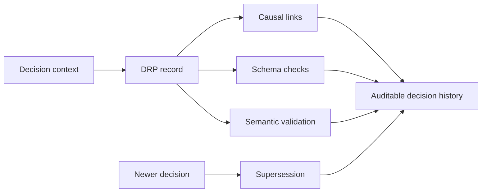

# Decision Record Protocol (DRP)

DRP is a lightweight, machine-readable protocol for recording decisions as
immutable, linkable records with causal links, validation rules, and explicit
supersession.

It helps teams and AI systems answer a simple question:

> What was decided, why was it decided, what did it depend on, and what replaced
> it later?

This repository is the **canonical specification and reference tooling** for
DRP. It is intentionally not an application; it defines the data format,
the invariants, and the validator that any DRP-compatible system should
honor.

## At a glance

DRP gives you:

- structured decision records instead of scattered notes;
- stable `record_id` values for linking and audit;
- explicit causal links through `parent_record_ids` and `child_record_ids`;
- append-only evolution through `supersedes_record_id`;
- schema checks plus validator-backed graph invariants;
- runnable examples, fixtures, tests, and benchmark material.

## The problem DRP solves

Many important decisions start as chat messages, tickets, meeting notes, or
incident comments. Over time, the original context disappears:

- the reason for the decision becomes unclear;
- the alternatives considered are lost;
- later changes silently overwrite earlier intent;
- decision chains become hard to audit or replay;
- free-form prose cannot reliably enforce graph-level consistency.

DRP turns those decisions into small, structured records that can be validated,
linked, superseded, tested, and inspected over time.

For a standalone introduction, see [Why DRP](docs/WHY_DRP.md).

## Core flow



## When to use DRP

DRP is useful when decisions need to survive beyond a single conversation,
meeting, or tool run.

Common use cases:

1. **AI agent decision trails** - record why an agent chose a route, which
   prior records it depended on, and whether the decision was later superseded.
2. **Incident response and rollback** - preserve emergency decisions,
   mitigations, follow-up actions, and the causal chain between them.
3. **Architecture or product decisions** - keep decision history structured
   while still allowing ADR-style narrative documents around it.
4. **Policy and governance changes** - represent policy updates without
   silently rewriting prior records.

## Why not just ADR?

Architecture Decision Records are excellent for human-readable design history.
DRP is narrower and more mechanical: it defines machine-readable records,
validation rules, causal graph checks, and supersession semantics.

In practice, DRP can complement ADR:

- ADR explains the narrative.
- DRP preserves the structured decision state and validation contract.

For a fuller comparison, see [DRP and ADR](docs/COMPARISON_ADR.md).

## Why DRP

Most decision logs degrade into free-form prose that cannot be audited,
queried, or diffed. DRP fixes this by:

- treating each decision as a structured record with a stable `record_id`;
- forbidding silent mutation; corrections are expressed as *supersession*;
- making causality explicit through `parent_record_ids`;
- shipping a schema **and** a validator, because schema alone cannot express
  graph-level invariants (bidirectional links, timestamp ordering,
  supersession resolution, etc.).

## Try DRP in 60 seconds

Validate a known-good example:

```sh
python3 tools/drp_validator.py examples/minimal_valid.json
```

Or use the wrapper:

```sh
./scripts/drp-validate examples/minimal_valid.json
```

For CI jobs and tool integrations, use `--json` for machine-readable output:

```sh
./scripts/drp-validate examples/minimal_valid.json --json
# {"status": "OK", "record_count": 1, "errors": []}
```

Run the test suite:

```sh
python3 -m pytest tests/
```

Exit code is `0` on success, `1` on validation failure, `2` on unreadable
input. See [docs/VALIDATION.md](docs/VALIDATION.md) for the full CLI
contract.

## Status

| Item       | Value              |
|------------|--------------------|
| Version    | `0.1.0` (see [VERSION](VERSION)) |
| Stability  | Draft -- breaking changes possible before `1.0.0` |
| License    | MIT ([LICENSE](LICENSE)) |

## Repository layout

```
.
+-- README.md                  - this file
+-- LICENSE                    - MIT
+-- VERSION                    - current protocol version
+-- CHANGELOG.md               - version history
+-- CONTRIBUTING.md            - how to propose changes
+-- docs/
|   +-- SPEC.md                - formal specification
|   +-- VALIDATION.md          - validator rules and CLI contract
|   +-- DESIGN.md              - rationale behind design choices
|   +-- FAQ.md                 - common questions
|   +-- WHY_DRP.md             - standalone introduction
|   +-- COMPARISON_ADR.md      - comparison with Architecture Decision Records
|   +-- USE_CASE_SAFETY_EVAL.md      - go/no-go decisions around safety evaluations
|   +-- USE_CASE_INCIDENT_ROLLBACK.md - incident response and rollback chain
|   +-- USE_CASE_POLICY_SUPERSESSION.md - policy evolution and governance change
|   +-- BENCHMARKS.md          - auditability benchmark pack overview
|   \-- RESEARCH_NOTE.md       - research framing and evaluation seed
+-- schema/
|   \-- drp.schema.json        - JSON Schema (Draft 2020-12)
+-- examples/                  - illustrative, valid records
+-- fixtures/
|   +-- valid/                 - regression fixtures that must validate
|   \-- invalid/               - regression fixtures that must fail
+-- benchmark/
|   \-- drp_auditability_pack/ - scenario-grounded benchmark pack
+-- tools/
|   \-- drp_validator.py       - reference validator implementation
+-- scripts/
|   +-- drp-validate           - CLI wrapper around the validator
|   \-- run_benchmark.py       - runs the auditability pack
\-- tests/                     - automated tests for schema + validator
```

## Key documents

- [Why DRP](docs/WHY_DRP.md) - standalone introduction to the problem and motivation.
- [DRP and ADR](docs/COMPARISON_ADR.md) - how DRP relates to Architecture Decision Records.
- [Grant Evidence Package](docs/GRANT_EVIDENCE.md) - reviewer-facing evidence matrix, reproducible commands, limitations, and research roadmap.
- [Specification](docs/SPEC.md) - normative definition of the record model.
- [Validation](docs/VALIDATION.md) - what the validator checks and how.
- [Design rationale](docs/DESIGN.md) - why DRP looks the way it does.
- [FAQ](docs/FAQ.md) - practical questions.
- [JSON Schema](schema/drp.schema.json) - machine-readable shape.
- [Examples](examples/) - idiomatic records.
- [Fixtures](fixtures/) - positive and negative validator fixtures.

## Use cases

Realistic scenarios showing where DRP is intended to be applied:

- [Safety evaluation / go-no-go](docs/USE_CASE_SAFETY_EVAL.md) -
  recording deploy / no-deploy / restricted-deploy decisions around a
  safety eval, including later supersession.
- [Incident response / rollback](docs/USE_CASE_INCIDENT_ROLLBACK.md) -
  recording emergency mitigations and subsequent corrective actions as
  a traceable chain.
- [Policy supersession / governance change](docs/USE_CASE_POLICY_SUPERSESSION.md) -
  representing policy evolution so that the currently effective policy
  is always recoverable.

## Benchmarks and research framing

- [Auditability benchmark pack](benchmark/drp_auditability_pack/) -
  compact valid / invalid / ambiguous / comparison fixtures grounded in
  the use cases above.
- [Benchmarks overview](docs/BENCHMARKS.md) - what the pack is, what it
  checks, and what it explicitly does not claim.
- [Research note](docs/RESEARCH_NOTE.md) - problem framing, hypotheses,
  a minimal evaluation outline, and the limits of the current
  repository.

## Conformance

A system is DRP-conformant at version `X.Y.Z` if every record it produces
validates successfully against the schema **and** the reference validator
at that version. Schema-only validation is not sufficient; see
[VALIDATION.md](docs/VALIDATION.md).
