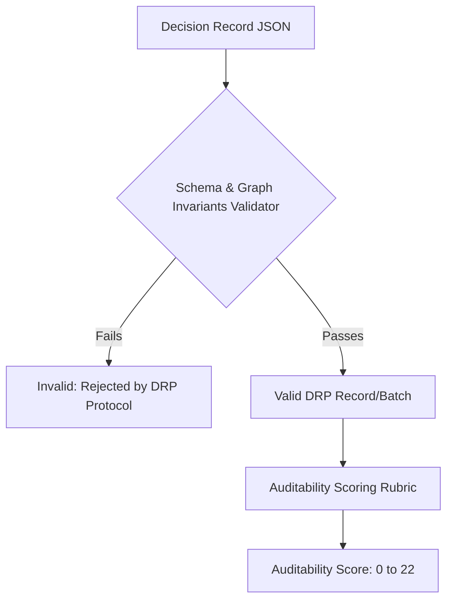

# Decision Record Protocol (DRP) Auditability Scoring Rubric (v0)

This document defines a research-oriented scoring rubric for evaluating how **auditable** a decision record or a chain of decision records is. 

---

## 1. Validation vs. Scoring

Before scoring a decision record, it is critical to distinguish **validation** from **scoring**:



*   **Validation (Pass/Fail):** Done automatically by the reference validator (e.g., `tools/drp_validator.py`). It checks syntactic and graph-level invariants (e.g., correct JSON type, valid timestamps, parent/child bidirectional consistency, and lack of dependency cycles). An invalid record cannot be scored because it violates core DRP protocol semantics.
*   **Scoring (Quantitative Measure of Quality):** Evaluates the semantic usefulness, completeness, and clarity of valid records. It measures *how easy* it is for a human auditor or automated system to reconstruct the context, motivations, and impact of a decision.

---

## 2. Scoring Dimensions

The v0 rubric uses **8 dimensions**. A decision record's total auditability score is the sum of these dimensions, ranging from **0 (extremely poor auditability)** to **22 (maximum auditability)**.

### Dimension 1: Context Completeness
*   **What it measures:** The quality and thoroughness of the `context` field in describing *why* the decision is necessary. It looks for background detail, root causes, constraints, and problem parameters.
*   **Score Range:** 0 to 3
*   **Evaluation Method:** Both (Can be checked manually or estimated using NLP/LLM systems looking for specific entity mentions like metrics, system components, or historical constraints).
*   **Rubric Details:**
    *   **0 (Unacceptable):** Extremely short, generic statement that provides no actionable context (e.g., `"Need to make a change."`).
    *   **1 (Low):** Identifies the general subject but lacks metrics, specific system components, or root causes (e.g., `"The web server has high response times."`).
    *   **2 (Medium):** Specifies the problem, affected components, and the operational triggers or historical facts, but misses precise metrics or exact constraints (e.g., `"API response times spiked after the v2 deploy because DB connections are exhausted. We need to optimize pooling."`).
    *   **3 (High):** Fully documents the context with quantitative data, specific links/incidents, and business or technical constraints (e.g., `"DB connection pool exhaustion during peak hours (14:00-16:00 UTC) caused 500 errors to spike to 4.2% on our gateway. Target service is 'billing-api'. We are constrained by our current AWS RDS instance size db.t3.medium."`).

---

### Dimension 2: Decision Clarity
*   **What it measures:** The clarity and actionability of the `decision` field. An auditor must be able to tell exactly *what* was committed and how to verify or implement it.
*   **Score Range:** 0 to 3
*   **Evaluation Method:** Manual (Requires human semantic understanding, although LLMs can analyze for imperative verbs and clear actions).
*   **Rubric Details:**
    *   **0 (Unacceptable):** Vague, ambiguous, or non-actionable (e.g., `"Make it faster."`).
    *   **1 (Low):** States the general direction but leaves implementation details completely open (e.g., `"We will adjust the database pool size."`).
    *   **2 (Medium):** Clear action and target, but lacks explicit values, rollouts, or operational parameters (e.g., `"Increase the connection pool size in 'billing-api' and set up pool alerts."`).
    *   **3 (High):** Explicitly states what is being done, exact parameters, target files/components, and verification mechanism (e.g., `"Increase the max DB connection pool size from 20 to 50 in `billing-api/config.json`. Configure Datadog alerts to trigger at 85% pool utilization. Deploy via progressive canary rollouts."`).

---

### Dimension 3: Options Coverage
*   **What it measures:** The breadth of alternatives documented in the `options` array. It ensures the decision was not made in a vacuum.
*   **Score Range:** 0 to 3
*   **Evaluation Method:** Both (Automated check for option count; manual check for distinctness and relevance).
*   **Rubric Details:**
    *   **0 (Unacceptable):** Only lists the chosen option, showing zero alternatives were considered (e.g., `["Increase pool size"]`). Note: DRP validation requires $\ge 1$ option, so this is valid but scores poorly.
    *   **1 (Low):** Lists two options, but the alternative is a generic "Do nothing" or a strawman that is not realistically viable (e.g., `["Increase pool size", "Do nothing"]`).
    *   **2 (Medium):** Lists at least two distinct, realistic alternatives with some detail (e.g., `["Increase local pool size", "Deploy a connection pooler like PgBouncer", "Migrate to DynamoDB"]`).
    *   **3 (High):** Lists three or more realistic, distinct options, including trade-offs or cost/benefit vectors (e.g., `["Option A: Increase pool size to 50 (Low risk, quick fix, but higher DB RAM)", "Option B: Adopt PgBouncer (Best scaling, but adds infrastructure complexity)", "Option C: DB Read Replicas (Reduces load, but read-consistency lags)"]`).

---

### Dimension 4: Causal Link Quality
*   **What it measures:** The richness and correctness of the relationship graph expressed through `parent_record_ids` and `child_record_ids`.
*   **Score Range:** 0 to 3
*   **Evaluation Method:** Both (Validator checks graph invariants automatically; human/LLM verifies if the referenced parent decisions actually have a logical, causal relationship to the current decision).
*   **Rubric Details:**
    *   **0 (Unacceptable):** The record has zero causal links (`parent_record_ids` and `child_record_ids` are empty) despite representing a modification of an existing system feature.
    *   **1 (Low):** Lists links, but they are either logically weak or point to irrelevant decisions just to fill the field.
    *   **2 (Medium):** Explicitly links to direct parent motivating decisions, creating a clear history trail (e.g., pointing to the decision that originally provisioned the `db.t3.medium` RDS instance).
    *   **3 (High):** Links both upstream motivating parents AND downstream impacted children. The relationships are clearly explained in the `rationale` (e.g., `"This decision is a direct mitigation of dec-102 (RDS provisioning) and will motivate dec-106 (pool monitoring rules)."`).

---

### Dimension 5: Supersession Clarity
*   **What it measures:** The explicit linking and state transition of replaced decisions.
*   **Score Range:** 0 to 3
*   **Evaluation Method:** Both (Validator automatically ensures `supersedes_record_id` is present if status is `"superseded"`; manual/LLM checks if the rationale describes *why* the old decision is being superseded).
*   **Rubric Details:**
    *   **0 (Unacceptable):** Replaces/renders an older decision obsolete but does *not* set `status: "superseded"` or provide a `supersedes_record_id`.
    *   **1 (Low):** Declares `supersedes_record_id` but provides no rationale as to why the previous decision failed or is being retired.
    *   **2 (Medium):** Sets `supersedes_record_id` and provides a brief reason for replacement in the text.
    *   **3 (High):** Fully models the supersession: `status` is set to `"superseded"`, `supersedes_record_id` is present, and the `rationale` lists exactly what changed in assumptions or conditions to render the previous record obsolete (e.g., workload increases, new vendor, performance bottlenecks discovered).

---

### Dimension 6: Timestamp and Ordering Clarity
*   **What it measures:** The exact chronological placement of the decision record relative to actual real-world occurrences (incident timelines, code commits, etc.).
*   **Score Range:** 0 to 2
*   **Evaluation Method:** Both (Auto checks for ISO 8601 UTC formats and parent-child time monotonicity; manual/LLM correlates timestamps with git history or ticket system dates).
*   **Rubric Details:**
    *   **0 (Low):** Timestamps are set to an arbitrary date, or represent massive lag (>1 month) between the actual decision event and the DRP record commit.
    *   **1 (Medium):** Timestamps align correctly with standard UTC formatting and match within a few days of the ticket/PR approval.
    *   **2 (High):** High-fidelity ordering. The timestamp is precisely correlated with the merge commit or git tag, and there are no overlapping/identical timestamps in the dependency path (which allows exact topological sorting).

---

### Dimension 7: Machine-Checkability
*   **What it measures:** The presence and structure of optional parameters that allow automated policy checking (e.g., using `impact`, structured `tags`, and strict schemas).
*   **Score Range:** 0 to 2
*   **Evaluation Method:** Automatic (Evaluates presence of fields and adherence to strict structural tags).
*   **Rubric Details:**
    *   **0 (Low):** Optional helper fields are completely omitted. `impact` is left `null` or omitted, and `tags` is empty.
    *   **1 (Medium):** Either `impact` (non-null) or `tags` are populated with descriptive parameters, allowing basic tag-based querying.
    *   **2 (High):** Full structured checkability. `impact` is explicitly set to `-1`, `0`, or `1`. Structured tags (e.g., `["domain:db", "env:prod", "risk:low"]`) are used, and the `metadata` object is leveraged to supply structured parameters (e.g., `{"incident_ref": "INC-882"}`).

---

### Dimension 8: Ambiguity Risk
*   **What it measures:** The presence of hand-waving terms, passive voice, or vague references that could cause misinterpretation by downstream engineers or auditors.
*   **Score Range:** 0 to 3
*   **Evaluation Method:** Manual or Automatic (using simple grammar checks or LLM classifiers).
*   **Rubric Details:**
    *   **0 (Unacceptable):** High ambiguity. Uses terms like *"we might"*, *"as soon as possible"*, *"optimize if necessary"*, *"various systems"*, or *"some servers"*.
    *   **1 (Low):** Mostly clear, but contains at least one major ambiguous scope boundary (e.g., `"Deploy pgBouncer to all critical databases."` without defining which databases are classified as critical).
    *   **2 (Medium):** Very low ambiguity. Uses concrete nouns and explicit terms, although occasional minor non-quantified adjectives exist.
    *   **3 (High):** Zero ambiguity. Every system name, metric, threshold, team, and responsibility is explicitly defined (e.g., specifying `"database instances 'billing-primary-rds' and 'auth-primary-rds'"` instead of `"important databases"`).

---

## 3. Rubric Summary Table

| Dimension | Scope / Focus | Min Score | Max Score | Core Check Method |
| :--- | :--- | :---: | :---: | :--- |
| **1. Context Completeness** | Explains *why* the decision is necessary | 0 | 3 | Manual / NLP |
| **2. Decision Clarity** | Explains *what* has been decided and done | 0 | 3 | Manual |
| **3. Options Coverage** | Breath of alternatives considered | 0 | 3 | Both |
| **4. Causal Link Quality** | Upstream & downstream relationship graph | 0 | 3 | Both |
| **5. Supersession Clarity** | Replaced decisions and rationales | 0 | 3 | Both |
| **6. Timestamp/Ordering** | Chronological and topological alignment | 0 | 2 | Both |
| **7. Machine-Checkability**| Use of `impact`, `tags`, and `metadata` | 0 | 2 | Automatic |
| **8. Ambiguity Risk** | Absence of vague/hand-waving phrases | 0 | 3 | Manual / NLP |
| **TOTAL** | **Auditability Index (Higher is better)** | **0** | **22** | |

---

## 4. What the Rubric Does NOT Prove

> [!IMPORTANT]
> **Auditability $\neq$ Correctness**
> High auditability scores indicate a well-documented, traceable, and understandable decision process. It does **NOT** prove that the decision itself is correct, optimal, safe, or bug-free.

Specifically, a decision record scoring **22/22** on this rubric does not guarantee:
1.  **Correctness:** A decision to `"Set DB connection pool to 1,000,000"` might be exceptionally clear, well-referenced, and structured, but it is technically disastrous and will crash the database.
2.  **Safety:** A record can document a high-risk security bypass with flawless causal links, clear options, and zero ambiguity. The record is highly *auditable* (which is good for forensics), but the underlying change remains highly *unsafe*.
3.  **Ethical/Business Soundness:** The rubric does not measure business alignment, ROI, ethical considerations, or customer satisfaction.

---

## 5. Comparative Examples

### Example 1: Incident Rollback (Database Outage)

#### Vague Free-Form Note (Auditability Score: 2/22)
> **Slack Message from `@engineer` in `#alerts-prod`:**
> *"DB got overloaded, so we rolled back the latest migration. Things seem fine now. We should figure out pool settings later."*

*Why this scores poorly:*
*   **Context:** Extremely vague; no metrics, DB instance name, or root cause. (Score: 0)
*   **Decision:** "rolled back the latest migration" is ambiguous (which migration?). (Score: 1)
*   **Options:** None listed. (Score: 0)
*   **Causal Links:** None. (Score: 0)
*   **Supersession:** None linked. (Score: 0)
*   **Timestamp:** Slack message header has time, but no stable record ordering exists. (Score: 1)
*   **Machine-Checkability:** None. (Score: 0)
*   **Ambiguity:** High ("Things seem fine", "figure out pool settings later"). (Score: 0)

---

#### Structured DRP Record (Auditability Score: 21/22)
```json
{
  "record_id": "dec-2026-004",
  "timestamp": "2026-05-30T16:12:00Z",
  "status": "superseded",
  "supersedes_record_id": "dec-2026-002",
  "context": "At 15:45 UTC, RDS database 'prod-billing-db' experienced 100% CPU utilization and connection exhaustion (max 500 connections reached), causing a 12-minute outage of the billing service. This was triggered by slow queries from migration '0042_add_billing_indexes' added in dec-2026-002.",
  "decision": "Roll back migration '0042_add_billing_indexes' on environment 'production' immediately. Pin the application version to build v2.4.1.",
  "options": [
    "Option 1: Roll back migration '0042_add_billing_indexes' (Fastest recovery, temporarily stops index optimization)",
    "Option 2: Increase DB capacity to db.r5.2xlarge (High cost, slow propagation time, does not solve the bad query plan)",
    "Option 3: Kill active migration queries (High risk of corrupting migration state table)"
  ],
  "rationale": "Option 1 was chosen because restoring billing-api service immediately was our P0 metric. Migration rollback safely completed at 16:08 UTC, restoring CPU utilization to normal levels (<20%). This supersedes dec-2026-002, which initially approved migration rollout.",
  "impact": 1,
  "parent_record_ids": ["dec-2026-002"],
  "child_record_ids": ["dec-2026-005"],
  "tags": ["incident", "rollback", "domain:database"],
  "metadata": {
    "incident_id": "INC-48821",
    "target_env": "production"
  }
}
```

*Why this scores highly:*
*   **Context:** Extremely detailed, includes timestamps, metrics, names of systems, and the underlying migration. (Score: 3)
*   **Decision:** Very clear, names specific action and target systems. (Score: 3)
*   **Options:** Lists three highly realistic alternatives with brief pros/cons. (Score: 3)
*   **Causal Links:** Explicitly links parent and child records. (Score: 3)
*   **Supersession:** Explicitly marks status as `"superseded"` and targets `dec-2026-002`. (Score: 3)
*   **Timestamp:** ISO format, clean. (Score: 2)
*   **Machine-Checkability:** Leverages `impact`, `tags`, and `metadata`. (Score: 2)
*   **Ambiguity:** Zero hand-waving terms. (Score: 2)

---

### Example 2: Security & Encryption Policy

#### Vague Free-Form Note (Auditability Score: 3/22)
> **Wiki Page Section:**
> *"We decided to turn on encryption because of security concerns. Use standard options."*

---

#### Structured DRP Record (Auditability Score: 20/22)
```json
{
  "record_id": "dec-sec-012",
  "timestamp": "2026-05-30T12:00:00Z",
  "status": "complete",
  "context": "Compliance audit COMP-2026 highlighted a high-severity finding: S3 buckets storing PII data are currently unencrypted at rest, which violates SOC2 CC6.3 requirements.",
  "decision": "Enforce AWS KMS-Managed Keys (SSE-KMS) on all S3 buckets within the 'production' and 'staging' accounts. Block any uploads that do not specify encryption.",
  "options": [
    "AWS KMS SSE-KMS (Recommended: allows key rotation auditing, requires KMS budget)",
    "Amazon S3-Managed Keys SSE-S3 (Zero cost, but lacks fine-grained key access policies)",
    "Client-Side Encryption (CSE) (Highest security, but requires writing manual encryption logic in 12 separate microservices)"
  ],
  "rationale": "SSE-KMS was selected to satisfy the auditing criteria of SOC2. The increased KMS cost (~$15/month) is acceptable compared to compliance failure risk.",
  "impact": 1,
  "parent_record_ids": [],
  "child_record_ids": [],
  "tags": ["security", "compliance", "aws:s3"],
  "metadata": {
    "compliance_framework": "SOC2-CC6.3",
    "audit_reference": "COMP-2026"
  }
}
```

---

## 6. Future Work: `scripts/score_auditability.py`

To make the scoring rubric actionable, a future utility script can automate parts of the rubric. Below is the proposed architecture of `scripts/score_auditability.py`.

### Automation Feasibility Matrix

| Dimension | Automated Part | Manual/LLM Part |
| :--- | :--- | :--- |
| **Context Completeness** | Check text length | LLM analysis of named entity coverage |
| **Decision Clarity** | Check imperative verbs | Human evaluation of action feasibility |
| **Options Coverage** | Count items in array (0 to 3 points) | Verify if options are distinct alternatives |
| **Causal Link Graph** | Validate presence of parent/child tags | Audit logical reasoning of relationships |
| **Supersession** | Validate matching states and IDs | Verify why the replacement happened |
| **Timestamp/Ordering** | Enforce formatting and monotonicity | Cross-check with git metadata |
| **Machine-Checkability**| Parse `impact`, `tags`, and `metadata` structures | N/A (100% automated) |
| **Ambiguity Risk** | Regex checks for forbidden terms | LLM checks for hand-waving or passive voice |

### Conceptual Script Interface

```python
# scripts/score_auditability.py
import argparse
import json
import re

def compute_machine_checkability(record):
    score = 0
    if record.get("impact") is not None:
        score += 1
    if record.get("tags") and len(record["tags"]) > 0:
        score += 1
    return score

def compute_options_coverage(record):
    opts = record.get("options", [])
    if len(opts) >= 3:
        return 3
    elif len(opts) == 2:
        return 2
    elif len(opts) == 1:
        return 1
    return 0

def check_ambiguity_regex(record):
    # Simple regex check for hand-waving terms
    forbidden = r"\b(we might|some|various|asap|as soon as possible|probably|optimize if necessary)\b"
    text = (record.get("context", "") + " " + record.get("decision", "")).lower()
    matches = re.findall(forbidden, text)
    if len(matches) > 0:
        return 0 # High ambiguity risk detected
    return 3 # Clean of common forbidden words

# ... (Additional scoring logic)
```

Usage would be:
```bash
python scripts/score_auditability.py --batch examples/incident_rollback_batch.json
```
Outputting a structured JSON or Markdown report of the scores per record.
