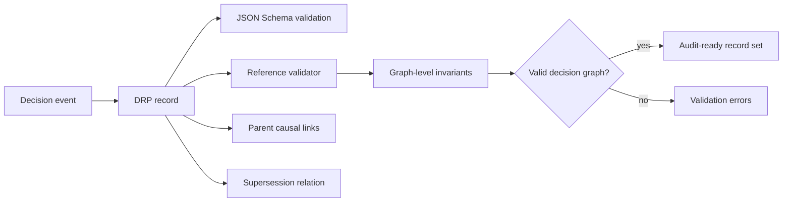

# Grant Evidence Package

Status: reviewer-facing evidence package.

Scope: this document summarizes the current Decision Record Protocol (DRP) artifact, reproducible reviewer path, evidence assets, explicit non-claims, and near-term research roadmap for grant reviewers.

## One-sentence claim

Decision Record Protocol (DRP) is an open-source protocol and reference validator for recording decisions as immutable, linkable, machine-readable records with explicit causal links and supersession semantics.

## Core idea

DRP treats decisions as structured records rather than free-form prose.

```text
decision -> structured record -> causal links -> supersession graph -> validator -> audit-ready decision history
```

The goal is to make decision provenance explicit, machine-checkable, and reusable across safety, governance, incident response, and agentic oversight workflows.

## Reviewer path

A reviewer can validate the current artifact locally without private services or external APIs.

```bash
python3 -m pytest tests/
```

Validate a single record:

```bash
python3 tools/drp_validator.py examples/minimal_valid.json
```

Use the CLI wrapper:

```bash
./scripts/drp-validate examples/minimal_valid.json
```

Machine-readable validation output:

```bash
./scripts/drp-validate examples/minimal_valid.json --json
```

Run the benchmark pack:

```bash
python3 scripts/run_benchmark.py
```

## Architecture at a glance



DRP is not an application or workflow engine. It defines the data format, invariants, and validator that DRP-compatible systems should honor.

## Current evidence matrix

| Evidence asset | Reviewer question | Path / command | Current status |
| --- | --- | --- | --- |
| Protocol specification | Is the decision record model normatively defined? | `docs/SPEC.md` | Documented |
| JSON Schema | Is the record shape machine-readable? | `schema/drp.schema.json` | Implemented |
| Reference validator | Are schema and graph-level invariants checked? | `tools/drp_validator.py` | Implemented |
| CLI contract | Can tools validate records in CI or automation? | `docs/VALIDATION.md`, `scripts/drp-validate` | Implemented |
| Valid fixtures | Are positive examples available? | `fixtures/valid/`, `examples/` | Implemented |
| Invalid fixtures | Are expected failures covered? | `fixtures/invalid/` | Implemented |
| Automated tests | Are validator rules regression-tested? | `python3 -m pytest tests/` | Implemented |
| Benchmark pack | Are realistic auditability scenarios represented? | `benchmark/drp_auditability_pack/`, `docs/BENCHMARKS.md` | Implemented |
| Research framing | Is there a research/evaluation seed? | `docs/RESEARCH_NOTE.md` | Documented |
| Use-case docs | Are realistic decision chains documented? | `docs/USE_CASE_*.md` | Documented |

## What is already implemented

- Canonical draft specification for DRP records.
- JSON Schema for record shape validation.
- Reference Python validator.
- CLI wrapper with machine-readable JSON output.
- Graph-level validation beyond schema-only checks.
- Causal parent links through `parent_record_ids`.
- Supersession semantics for non-mutating corrections and policy evolution.
- Valid and invalid regression fixtures.
- Automated tests for schema and validator behavior.
- Auditability benchmark pack grounded in realistic scenarios.
- Documentation for safety evaluation, incident rollback, and policy supersession use cases.

## What DRP makes inspectable

DRP is designed to make decision-history failures inspectable, such as:

- missing parent decisions,
- duplicate record identifiers,
- invalid supersession chains,
- timestamp-ordering inconsistencies,
- silent mutation instead of explicit correction,
- free-form decision logs that cannot be queried or diffed,
- policy or deployment decisions whose current effective state is unclear.

## What this project does not claim yet

DRP currently does not claim:

- production governance enforcement,
- complete organizational decision management,
- cryptographic signing or anchoring,
- distributed consensus,
- storage engine implementation,
- UI/workflow application,
- automatic correctness of human decisions,
- replacement of audit, legal, compliance, or incident-response process.

The current value is narrower: a machine-readable decision record protocol with schema, validator, fixtures, and benchmarkable auditability semantics.

## Why this is grant-relevant

Agentic systems and safety workflows increasingly need decisions that can be reviewed later: allow/block/escalate decisions, deployment gates, incident mitigations, policy updates, rollback choices, and human approvals.

Free-form prose logs are hard to validate, query, replay, or compare. DRP contributes one testable infrastructure primitive:

```text
structured decision record -> causal links -> supersession relation -> validator -> audit-ready decision graph
```

This makes decision provenance more reproducible and easier to integrate with evidence gates, trace replay, and causal audit systems.

## Research / build roadmap

Near-term grant-funded work can focus on:

1. **Specification hardening** — stabilize record fields, invariants, and versioning semantics.
2. **Validator conformance** — add a conformance suite for third-party DRP-compatible implementations.
3. **Decision graph queries** — support effective-policy resolution, ancestry, supersession lineage, and causal diff queries.
4. **Cryptographic anchoring** — define optional signing, hashing, and tamper-evidence profiles.
5. **Benchmark expansion** — add more scenarios for AI safety gates, incident response, governance, and policy evolution.
6. **Integration adapters** — connect DRP records to PythiaLabs, LTP traces, CML findings, CI systems, and issue trackers.
7. **Reviewer artifacts** — publish expected outputs and audit reports for benchmark scenarios.

## Relationship to PythiaLabs, LTP, and CML

DRP answers a different question from the other projects:

- **DRP:** What decision was made, why, what was considered, and how does it link to prior or later decisions?
- **PythiaLabs:** Should a proposed high-risk agent action be allowed, blocked, or escalated before tools are called?
- **LTP:** Was an agent execution path inspectable, replayable, anchored, and admissible?
- **CML:** Was an action causally valid under authorization, intent, and responsibility lineage?

Together they form complementary layers:

```text
DRP records decisions
PythiaLabs gates proposed actions
LTP replays and inspects execution paths
CML audits causal validity and responsibility lineage
```

## Suggested grant reviewer checklist

A reviewer can ask:

- Can I validate example records locally?
- Can I run tests and benchmark fixtures?
- Does the validator check more than schema shape?
- Are causality and supersession explicit?
- Are non-claims stated clearly?
- Is the protocol useful as infrastructure for safety, governance, and audit workflows?

## Current strongest positioning

Use this formulation in applications:

```text
DRP is an open-source protocol and reference validator for immutable, linkable, machine-readable decision records. It captures what was decided, why, what was considered, and how decisions causally relate or supersede one another.
```
